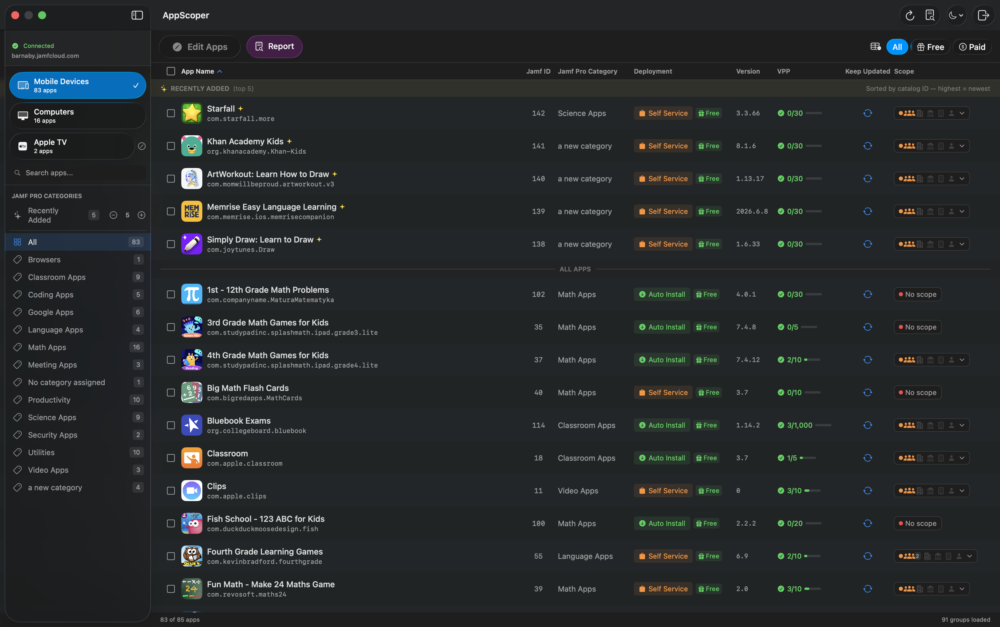
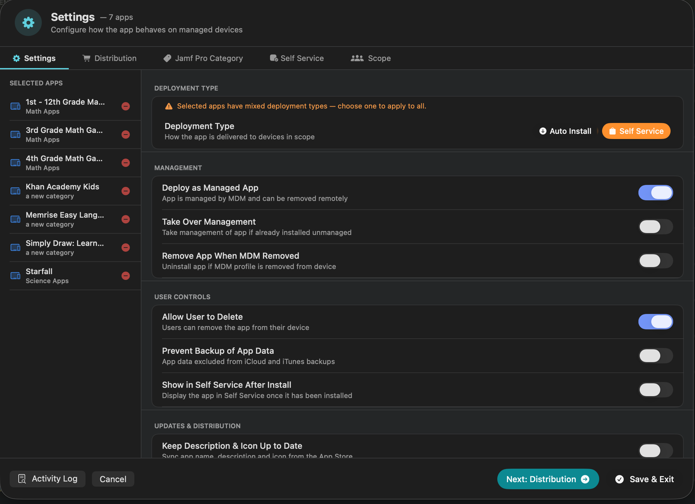

# AppScoper

AppScoper is a native macOS SwiftUI app for bulk VPP app scope management in Jamf Pro. It replaces the one-app-at-a-time workflow in the Jamf Pro UI with bulk operations across hundreds or thousands of apps.

## What it does

AppScoper connects to your Jamf Pro instance and gives admins a fast, focused view of the entire VPP app catalog — iOS, iPadOS, tvOS, and macOS apps in one list. Select any number of apps and apply changes across the whole selection at once:

- Set deployment type (Auto Install / Self Service)
- Assign or create a Jamf Pro category
- Set scope — groups, individual devices, users, user groups, buildings, departments
- Configure exclusions and limitations
- Duplicate apps with no scope (useful for staged rollouts)
- Delete apps that have no scope

Every bulk write goes through a typed-confirmation step. For "Replace Scope" operations the confirmation shows a delta — how many of the selected apps currently have scope that will be overwritten — so you can spot a misclick before it lands.

AppScoper supports two authentication modes, chosen on the login screen. The journey is **admin-first** — a Jamf Pro administrator bootstraps the setup, then provisions auditor access:

- **API Client** *(admin)* — OAuth2 client_credentials against `/api/oauth/token`. This is the starting point for the admin who manages AppScoper. The in-app Setup Wizard creates the AppScoper API Role and Client for you on first run.
- **Account** *(auditor or any Jamf Pro user)* — HTTP Basic against `/api/v1/auth/token` using a Jamf Pro user account. The auditor never bootstraps anything themselves — the admin provisions their account first (via the in-app Auditor Wizard or directly in Jamf Pro) and shares the credentials. AppScoper detects read-only privileges after login and hides destructive controls automatically.

## Feedback

Please send issues, feedback, or feature requests via email to appscoper.app.feedback at jamf, or open an issue on [GitHub](https://github.com/Jamf-Concepts/app-scoper/issues).

## Download

Download and install the latest `.pkg` installer from [GitHub Releases](https://github.com/Jamf-Concepts/app-scoper/releases/latest). The installer will place the AppScoper app in your Applications folder.

## Requirements

- macOS 26 (Tahoe) or later
- A Jamf Pro instance (cloud or on-prem)
- Either an API Client with the AppScoper Role *or* a Jamf Pro user account in the AppScoper Auditors group (see required permissions below)

## Setup

### Admin — API Client (recommended for admins)

From AppScoper's login screen, click **Configuration → Run Setup Wizard**.

*Step 1:* Enter your Jamf Pro server URL plus an admin username and password. These credentials are used only for the wizard call to create the role/client; they are not stored.

*Step 2:* AppScoper calls Jamf Pro to create an **AppScoper** API Role with the privileges listed below, then creates an **AppScoper** API Client and assigns the role.

*Step 3:* The wizard returns the new Client ID and Client Secret. AppScoper stores the Client ID in `UserDefaults` and the Client Secret in your macOS Keychain.

*Step 4:* Click **Connect** to log in with the new credentials.

| Privilege | Purpose |
| --- | --- |
| Read / Update Mac Applications | View and scope Mac VPP apps |
| Read / Update Mobile Device Applications | View and scope iOS / iPadOS / tvOS VPP apps |
| Read Computers | Scope to individual Mac computers |
| Read Mobile Devices | Scope to individual mobile devices |
| Read Smart / Static Computer Groups | Computer groups in Mac scope |
| Read Smart / Static Mobile Device Groups | Mobile groups in scope |
| Read User | List users for scope targeting |
| Read Smart / Static User Groups | User groups in scope |
| Read / Create / Update Categories | Show, create, and rename Jamf Pro categories |
| Read Buildings | Buildings in scope and exclusions |
| Read Departments | Departments in scope and exclusions |
| Read Network Segments | Network segments in limitations |
| Read Volume Purchasing Locations | VPP license counts and token info |
| Read LDAP Servers | Search directory user groups |

### Auditor — Read-Only Account (recommended for stakeholders)

Auditors are granted visibility into the app catalog but have no ability to make changes. Each auditor gets their own Jamf Pro user account in an **AppScoper Auditors** user-group. AppScoper detects the read-only privilege set after login and hides every write control.

From an admin's AppScoper, click **Configuration → Run Auditor Wizard**.

*Step 1:* Enter admin Jamf Pro credentials (used only during the wizard).

*Step 2:* Add one or more auditor **email addresses**. Each email becomes the auditor's Jamf Pro username.

*Step 3:* The wizard creates (or reuses) an **AppScoper Auditors** user-group in Jamf Pro with a Custom privilege set containing the exact read-only privileges AppScoper needs (listed below). It then creates a Jamf Pro user account for each auditor with a strong randomly-generated password. The password is stored encrypted in the auditor's macOS Keychain after first login; to rotate it, the admin can change the account password in Jamf Pro or delete and recreate the account via this wizard.

*Step 4:* AppScoper shows the credentials sheet. Send each auditor their email + temp password through your usual secure channel (1Password share, encrypted email, etc.).

*Step 5:* The auditor opens AppScoper, switches the login toggle to **Account**, enters their email and password, and connects. AppScoper authenticates against `/api/v1/auth/token`, probes the current principal's privilege list, and switches into read-only mode automatically.

| Privilege | Purpose |
| --- | --- |
| Read Mac Applications | View Mac VPP apps |
| Read Mobile Device Applications | View iOS / iPadOS / tvOS VPP apps |
| Read Computers | See individual Mac scope targets |
| Read Mobile Devices | See individual mobile device targets |
| Read Smart / Static Computer Groups | See computer-group scope |
| Read Smart / Static Mobile Device Groups | See mobile-group scope |
| Read Users | See user-based scope |
| Read Smart / Static User Groups | See user-group scope |
| Read Categories | See app categories |
| Read Buildings | See building scope and exclusions |
| Read Departments | See department scope and exclusions |
| Read Network Segments | See network-segment limitations |
| Read Volume Purchasing Locations | See VPP license counts |
| Read LDAP Servers | Resolve LDAP user-groups when scoping |

If your Jamf Pro environment is SSO-enforced and does not permit local user accounts, the Auditor Wizard will surface a clear error. In that case, you can use the regular Setup Wizard to create a read-only API Client and share those credentials instead.

## Using the app

Once connected, AppScoper shows the full VPP catalog. The sidebar filters by platform (Mac / iOS-iPadOS / tvOS) and Jamf Pro category. Search the main list by app name, bundle ID, or category.

Each row has a compact **scope cell** showing six dimensions at a glance — groups, buildings, departments, devices, users, and exclusions. Click any cell to open the scope popover for a full per-dimension breakdown.

Select one or more apps and choose **Edit** from the toolbar to bulk-modify settings, deployment type, category, Self Service appearance, or scope across the entire selection. Every save passes through a typed-confirmation modal that previews what's about to change.

## Securing Your Secrets

Credentials are stored in your macOS Keychain. Non-sensitive identifiers (server URL, Client ID, or username) live in `UserDefaults`; sensitive values (Client Secret or Account Password) live exclusively in the user-login Keychain at `kSecAttrService = "com.appscoper.jamf"`, encrypted at rest with `kSecAttrAccessibleWhenUnlocked`.

The in-app Activity Log records every API call, authentication event, and scoping operation. Diagnostic actions that capture organizational data (raw XML/JSON response bodies, category byte sequences) are gated behind a **Developer Mode** toggle in Configuration — off by default. When the log is exported, the save dialog displays a privacy warning listing what kinds of data the file may contain.

## Troubleshooting

The Activity Log toolbar button (or **Activity Log** in any edit sheet footer) opens a sheet that records every API call with timestamps. To capture a session for support:

1. Reproduce the issue
2. Open the Activity Log and review entries for errors (red) or warnings (orange)
3. **Copy All** copies the full log to clipboard; **Save Log…** writes it to a file with a privacy warning in the save panel

Common issues:

- *Devices not appearing in scope pickers* — Verify the API client (or auditor account) has **Read Computers** and **Read Mobile Devices**. The log will show HTTP 401 for those fetch calls if the privileges are missing.
- *401 / 403 errors on app updates* — Verify **Update Mac Applications** and **Update Mobile Device Applications**.
- *Setup Wizard / Auditor Wizard fails* — Confirm the admin account used has permission to create API Roles/Clients (for the Setup Wizard) or users/groups (for the Auditor Wizard). In Jamf Pro, that's typically Jamf Pro Administrator or equivalent.
- *Auditor login fails with 401* — Confirm the temp password matches what the wizard generated for that account. If you've manually rotated it in Jamf Pro Settings → User Accounts and Groups, use the rotated value. If the account has "Force user to change password at next login" enabled (set manually in Jamf Pro), uncheck it — that flag blocks API authentication for Group-Access accounts that have no Jamf Pro web UI path to satisfy it.

## Third-Party Libraries

AppScoper uses one third-party dependency:

| Library | License | Repository | License File |
| --- | --- | --- | --- |
| [TelemetryDeck Swift SDK](https://github.com/TelemetryDeck/SwiftSDK) v2.12.0 | MIT | https://github.com/TelemetryDeck/SwiftSDK | https://github.com/TelemetryDeck/SwiftSDK/blob/main/LICENSE |

AppScoper sends an anonymous message via TelemetryDeck when the app is initially opened. Knowing if anyone is using the app helps us decide if we should continue working on it. You can opt out at any time in the About screen.

## Terms of Use

This project is governed by the [Jamf Concepts Use Agreement](https://resources.jamf.com/documents/jamf-concept-projects-use-agreement.pdf).

Copyright 2026, Jamf Software LLC

[Jamf's Privacy Policy](https://www.jamf.com/trust-center/privacy/privacy-policy/)
